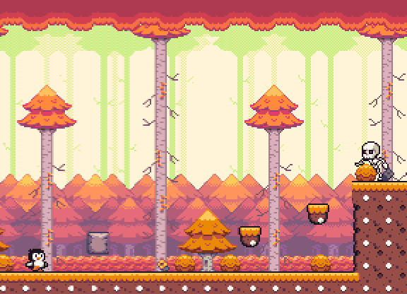
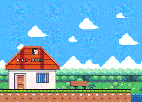
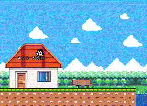
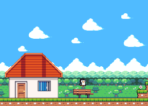
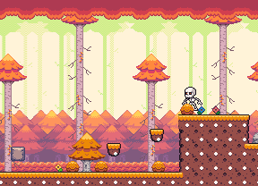
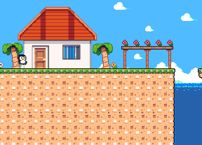

<h1 align="center">Jogo de Plataforma 2D</h1>

<p align="center">
  Um platformer 2D em pixel art desenvolvido com Godot 4 e GDScript.
</p>

<p align="center">
  <code>Godot 4.7.1</code> · <code>GDScript</code> · <code>Em desenvolvimento</code>
</p>

<p align="center">
  
</p>

<p align="center">
  <sub>Esquive dos projéteis, atravesse os obstáculos e explore cada canto das fases.</sub>
</p>

## Sobre o jogo

O jogador controla um pinguim por cenários com identidades e desafios diferentes. O projeto combina movimentação responsiva, exploração, inimigos, perigos ambientais e objetos interativos.

Atualmente existem quatro biomas em desenvolvimento:

1. **Pradaria** — uma introdução mais tranquila à movimentação.
2. **Inverno** — plataformas geladas e um cenário montanhoso.
3. **Floresta** — esqueletos, projéteis, lava e blocos quebráveis.
4. **Trópicos** — água, plataformas móveis e trechos de precisão.

## Em movimento

<p align="center">
  
  
</p>

<p align="center">
  <sub>Animações do personagem · Pradaria · Inverno · Floresta · Trópicos</sub>
</p>

## Mecânicas

- Movimento com aceleração e desaceleração.
- Pulo e múltiplos saltos configuráveis por fase.
- Agachamento e deslize.
- Animações de espera, incluindo sentar automaticamente e dançar.
- Interação e salto em paredes.
- Natação com física própria.
- Plataformas móveis com duração configurável.
- Blocos que quebram, caem e reaparecem após alguns segundos.
- Esqueletos com patrulha, detecção e ataque à distância.
- Sereia NPC amigável na área submersa da fase tropical.
- Caranguejos com patrulha lateral e detecção de paredes e bordas.
- Lava, projéteis e outras áreas letais.
- Checkpoints persistentes por fase com retorno após a morte.
- Transição automática entre fases.
- Cenários com múltiplas camadas de paralaxe.
- Máquina de estados para controlar as ações do jogador.

## Cenários

<p align="center">
  
  
  
</p>

## Controles

| Ação | Teclas |
| --- | --- |
| Mover para a esquerda | `A` ou `←` |
| Mover para a direita | `D` ou `→` |
| Pular / nadar | `W`, `↑` ou `Espaço` |
| Agachar / deslizar | `S` ou `↓` |
| Sentar / levantar | `3` ou automaticamente após 25 s parado |
| Animação de vitória (teste) | `4` |

## Checkpoints

O checkpoint utiliza a plaquinha do tileset de pradaria e pode ser reutilizado em qualquer fase. Ao ser ativada pelo jogador, a placa fica verde. Se o jogador morrer, a fase é recarregada e ele retorna ao último checkpoint alcançado naquela mesma fase.

Para adicionar um checkpoint pelo editor:

1. Arraste `res://entities/checkpoint.tscn` para a árvore da fase.
2. Posicione o nó `Checkpoint` no local desejado usando a ferramenta de movimento.
3. Se necessário, habilite **Filhos Editáveis** para ajustar `CollisionShape2D` ou `RespawnPosition`.
4. Execute a fase, encoste na placa e depois alcance uma área letal para testar o retorno.

Sem um checkpoint ativado, o jogador reaparece no início da fase. Ao entrar em outra fase, o checkpoint anterior é descartado.

## Como executar

### Pela Godot

1. Instale a **Godot 4.7.1**, versão utilizada no desenvolvimento.
2. Clone o repositório:

   ```bash
   git clone https://github.com/rafaelcairess/JogoPlataforma.git
   ```

3. No Gerenciador de Projetos da Godot, selecione **Importar**.
4. Escolha o arquivo `project.godot`.
5. Pressione `F5` para iniciar o jogo ou `F6` para executar a cena aberta.

Também é possível baixar o projeto como ZIP pelo GitHub e importar o `project.godot`. Não há dependências externas nem etapa adicional de compilação.

## Estrutura do projeto

```text
JogoPlataforma/
|-- entities/       # Jogador, inimigos e objetos reutilizáveis
|-- scene/          # Fases jogáveis
|-- scripts/        # Lógica de gameplay em GDScript
|-- sprites/        # Personagens, cenários e animações
|-- tiles/          # Terrenos, decorações, água e lava
|-- docs/           # Imagens e animações da documentação
`-- project.godot   # Configuração principal da Godot
```

## Estado do desenvolvimento

O projeto está em desenvolvimento. Entre os próximos passos estão o refinamento das fases, novos objetos interativos e mais feedback visual e sonoro para as ações do jogador.

## Créditos e licença

Os assets de pixel art são de **GrafxKid** e foram disponibilizados sob a licença **CC0 1.0 Universal**. Consulte o arquivo [LICENSE dos assets](sprites/Seasonal%20Tilesets/LICENSE.txt) para mais informações.

A licença do código-fonte do projeto ainda não foi definida.
