
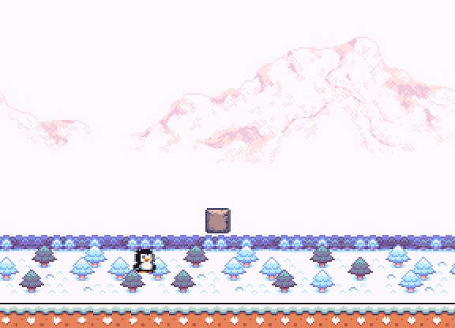
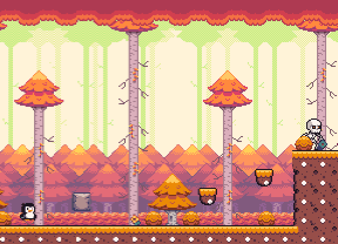
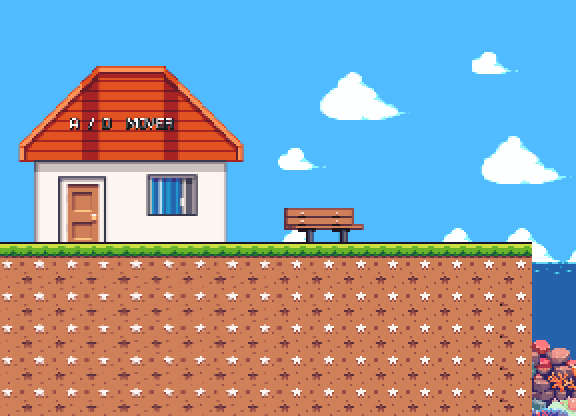
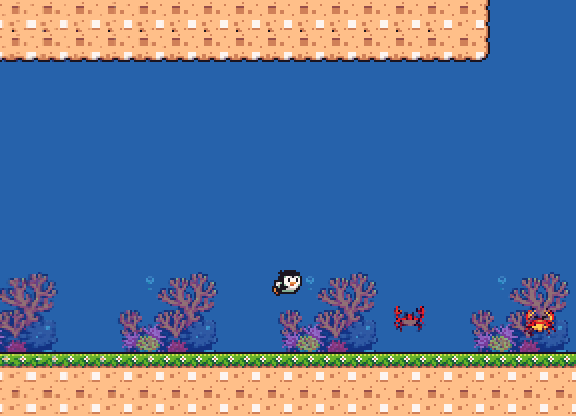

<h1 align="center">Peakguin 🐧</h1>

<p align="center">
  Um jogo de plataforma 2D em pixel art desenvolvido na Godot.
</p>

<p align="center">
  <code>Godot 4.7.1</code> · <code>GDScript</code> · <code>v0.02 Pre-Alpha</code>
</p>

<p align="center">
  
</p>

<p align="center">
  <sub>Até os pinguins precisam descansar de vez em quando.</sub>
</p>

## 🐧 Sobre

**Peakguin** é meu primeiro jogo indie de plataforma 2D.

O projeto ainda está bem no começo e está sendo desenvolvido por uma única pessoa. Estou cuidando da programação, das fases, das mecânicas, dos inimigos, das interações e do restante da construção do jogo utilizando Godot e GDScript.

A ideia é que Peakguin seja um platformer relativamente curto, com algo em torno de **3 horas de duração**, passando por diferentes regiões e introduzindo novas mecânicas durante o caminho.

Não quero que seja apenas uma sequência de plataformas. Também pretendo adicionar pequenos momentos de exploração e interação com personagens pelo mapa.

Um exemplo é a **sereia encontrada na fase tropical**, que futuramente terá diálogos com o pinguim. A intenção é adicionar outros NPCs ao longo da aventura, dando mais vida aos cenários e personalidade à jornada.

O projeto continua mudando bastante conforme aprendo mais sobre desenvolvimento de jogos e experimento novas ideias.

<p align="center">
  
</p>

<p align="center">
  <sub>Pradaria · Inverno · Floresta · Trópicos</sub>
</p>

## O jogo

Atualmente existem quatro áreas em desenvolvimento:

* **Pradaria** — uma área mais tranquila, usada para apresentar parte da movimentação.
* **Inverno** — plataformas em um cenário congelado e montanhoso.
* **Floresta** — esqueletos, projéteis, lava e blocos interativos.
* **Trópicos** — plataformas, água, natação, caranguejos e uma área submersa com uma sereia.

As fases ainda não estão finalizadas e provavelmente vão mudar bastante até uma versão completa do jogo.

## 🎮 Gameplay

### Floresta

<p align="center">
  
</p>

<p align="center">
  <sub>Esqueletos, projéteis, lava e plataformas.</sub>
</p>

### Movimentação

<p align="center">
  
</p>

<p align="center">
  <sub>Algumas das mecânicas de movimentação disponíveis atualmente.</sub>
</p>

### Área submersa

<p align="center">
  
</p>

<p align="center">
  <sub>A fase tropical também possui exploração debaixo d'água.</sub>
</p>

## Mecânicas implementadas

Até agora o jogo possui:

* Movimento com aceleração e desaceleração.
* Pulo e múltiplos saltos configuráveis.
* Agachamento.
* Deslize.
* Interação e salto em paredes.
* Natação.
* Máquina de estados para as ações do personagem.
* Plataformas móveis.
* Blocos quebráveis.
* Blocos que caem e reaparecem.
* Inimigos com patrulha.
* Esqueletos capazes de detectar e atacar o jogador.
* Caranguejos que detectam paredes e bordas.
* Lava, projéteis e outras áreas letais.
* Sistema de morte e respawn.
* Três corações de vida, com dano, cura e breve invulnerabilidade.
* HUD reformulada com fonte clássica em sprites, cronômetro persistente, número de moedas e vidas.
* Sistema de interação e diálogos estilo Stardew Valley (retratos, textos progressivos e caixas de diálogo dinâmicas).
* Moedas coletáveis e corações giratórios que recuperam vida.
* Poeira animada após três segundos de corrida contínua.
* Checkpoints.
* Transição entre fases.
* Cenários com paralaxe.
* Tela inicial com seletor de fases, configurações e créditos.
* Cursores pixel art para o mouse e para botões da interface.
* NPCs, ainda em fase inicial de implementação.

Também existem algumas animações extras para o pinguim. Se ele ficar parado durante algum tempo, por exemplo, acaba sentando sozinho.

## NPCs e diálogos

A ideia é que durante as fases seja possível encontrar personagens e conversar com eles, trazendo mais vida ao mundo enquanto o foco continua sendo plataforma.

O sistema de diálogos, inspirado em clássicos de RPG e Stardew Valley, já está funcional. Ele conta com:
- Detecção de áreas de interação ao redor do pinguim.
- Caixas de diálogo animadas na parte inferior da tela.
- Efeito "máquina de escrever" (typewriter) avançando o texto gradualmente.
- Retratos customizados e o nome de quem está falando.

A primeira personagem a utilizar esse sistema é a **sereia localizada na área submersa da fase tropical**. Experimente se aproximar dela e interagir!

## 🎮 Controles

| Ação                  | Teclas               |
| --------------------- | -------------------- |
| Mover para a esquerda | `A` ou `←`           |
| Mover para a direita  | `D` ou `→`           |
| Pular / nadar         | `W`, `↑` ou `Espaço` |
| Agachar / deslizar    | `S` ou `↓`           |
| Sentar / levantar     | `3`                  |

Os controles ainda podem mudar durante o desenvolvimento.

## Checkpoints

Algumas fases possuem checkpoints.

Quando o jogador ativa um deles, a placa muda de aparência. Caso o pinguim morra depois disso, a fase é recarregada e ele retorna ao último checkpoint alcançado.

Se nenhum checkpoint tiver sido ativado, ele volta para o começo da fase.

Ao avançar para outra fase, o checkpoint anterior é descartado.

## Como executar

### Executável para Windows

Para jogar sem instalar a Godot, baixe e execute:

**[Peakguin v0.02 Pre-Alpha para Windows](downloads/Peakguin-v0.02-pre-alpha.exe)**

O executável é uma versão **Pre-Alpha** para Windows 64 bits. Como ainda não
possui assinatura digital, o Windows pode pedir confirmação antes de abri-lo.

### Executar pelo projeto

O projeto utiliza **Godot 4.7.1**.

Clone o repositório:

```bash
git clone https://github.com/rafaelcairess/JogoPlataforma.git
```

Depois:

1. Abra a Godot.
2. Clique em **Importar**.
3. Selecione o arquivo `project.godot`.
4. Abra o projeto.
5. Pressione `F5` para executar.

Não existem dependências externas adicionais no momento.

## Estrutura do projeto

```text
JogoPlataforma/
├── entities/                   # Cenas que você arrasta para os níveis
│   ├── player/                 # Pinguim jogável
│   ├── enemies/                # Cogumelo, laranja e esqueletos
│   ├── creatures/              # Animais sem dano, como os caranguejos
│   ├── npcs/                   # NPCs, como a sereia
│   ├── pickups/                # Moedas e corações prontos para arrastar
│   ├── gameplay/               # Checkpoint, câmera, plataformas e saída
│   └── projectiles/            # Projéteis reutilizáveis
├── scene/                      # Grassland, Forest, Tropic e Winter
├── tiles/                      # Terrain, Decoration, Water e Lava juntos
├── audio/
│   ├── music/                  # Músicas das fases
│   └── sfx/                    # Efeitos sonoros do player e do ambiente
├── effects/                    # Splash da água e poeira de corrida
├── scripts/                    # Código separado pelas mesmas categorias
├── sprites/                    # Sprites brutos e pacotes de arte
├── fonts/                      # Fontes usadas pelo jogo
├── themes/                     # Temas globais da interface
├── ui/                         # HUD, menu principal e menu de pausa
├── docs/                       # GIFs e imagens usados no README
└── project.godot
```

Para montar uma fase, as pastas mais importantes no painel **Arquivos** da
Godot são `entities`, `scene` e `tiles`. As cenas dentro de `entities` podem
ser arrastadas diretamente para um nível. Os arquivos `terrain.tres`,
`decoration.tres`, `underwater.tres` e `lava.tres` ficam juntos em `tiles`
para serem encontrados rapidamente durante a construção dos mapas.

As cenas `entities/pickups/coin/coin.tscn` e
`entities/pickups/heart/heart.tscn` também podem ser arrastadas diretamente
para qualquer fase. A cena `ui/game_hud/game_hud.tscn` concentra a montagem
visual do HUD. No Player, as propriedades **Vida e coleta** e **Efeito de
corrida** permitem ajustar a vida máxima, o tempo de invulnerabilidade, os
três segundos de espera e o intervalo entre as partículas de poeira.

## 🚧 Estado atual

Peakguin ainda está **bem no começo do desenvolvimento**.

Existem várias mecânicas funcionando e algumas áreas jogáveis, mas ainda falta bastante conteúdo para chegar ao jogo que tenho em mente.

Entre as coisas que pretendo desenvolver estão:

* Sistema de diálogos.
* Mais NPCs.
* Novos inimigos.
* Mais fases e áreas.
* Sons e músicas.
* Interface e menus.
* Melhorias nas animações.
* Mais objetos interativos.
* Refinamento das fases existentes.
* Melhor equilíbrio de dificuldade.
* Uma progressão que resulte em aproximadamente 3 horas de jogo.

Como é um projeto desenvolvido por uma pessoa só e também meu primeiro jogo, não existe uma previsão definida para terminar.

A prioridade é continuar aprendendo e melhorar o projeto aos poucos.

## Créditos

Os assets de pixel art utilizados no projeto são de **GrafxKid** e foram disponibilizados sob a licença **CC0 1.0 Universal**.

A licença pode ser encontrada em:

[`sprites/Seasonal Tilesets/LICENSE.txt`](sprites/Seasonal%20Tilesets/LICENSE.txt)

A fonte pixel **at01**, também criada por GrafxKid e disponibilizada sob
**CC0 1.0**, é utilizada nos textos. O projeto inclui uma variante própria com
os glifos necessários ao português.

[`fonts/at01_pt_br/README.md`](fonts/at01_pt_br/README.md)

A programação, montagem das fases, implementação das mecânicas e desenvolvimento geral de Peakguin são feitos por mim.

## Licença

A licença do código-fonte ainda não foi definida.
